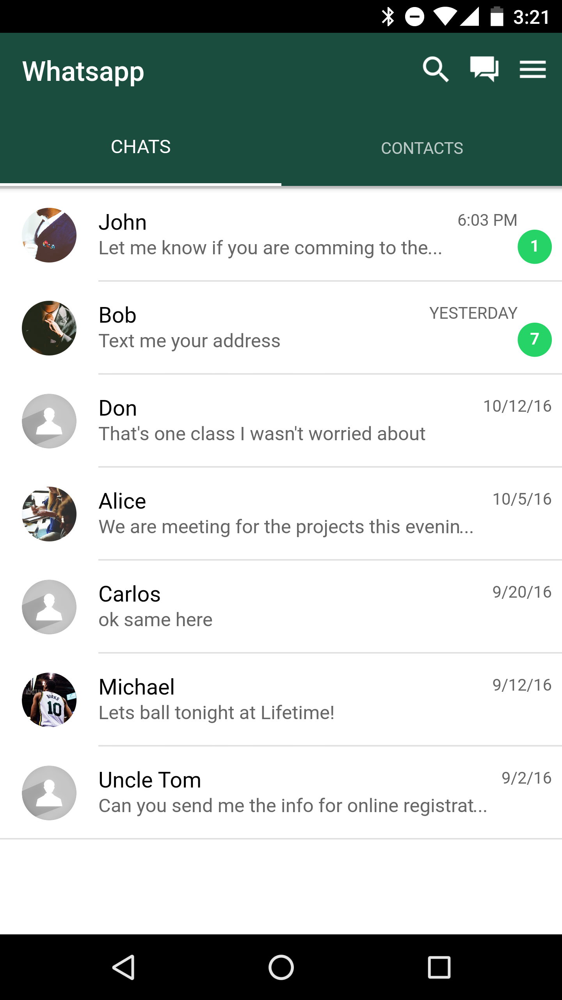

# Whatsapp clone in Ionic 2 and Angular 2

##Install:

#### Install Ionic 2:       
`npm install -g ionic@beta`
#### Install Cordova:        
`npm install -g cordova`
#### Install Required Packages
`npm install`

## Android

####Install : 
`ionic platform add android`
####Run     : 
`ionic emulate ios`

## iOS
 
####Install : 
`ionic platform add ios`
####Run     : 
`ionic emulate ios`

## Browser

`ionic serve`

